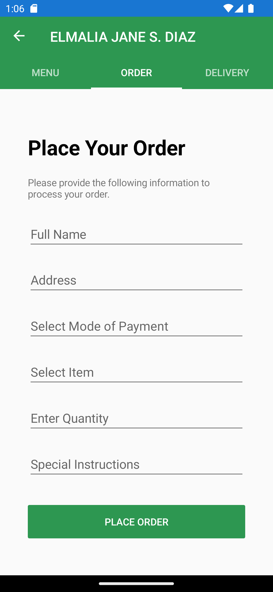
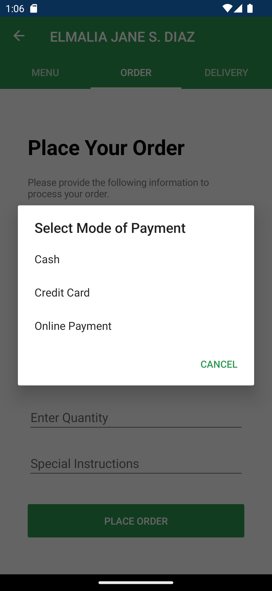
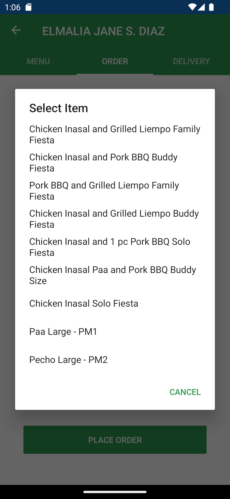
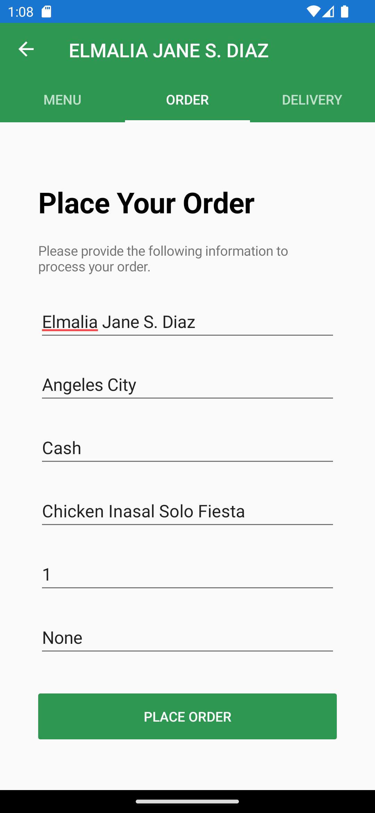

# Module 04 - Exercise 01 (PDC03-LAB)

    Name of Student: Elmalia Jane S. Diaz
    Year and Section: BSIT3A
    Activity Title: Module 04 - Exercise 02
    Date Submitted: April 13, 2024
    
## Hierarchy Navigation
### Source Code
- [MainPage.xaml](Module04Navigation/Module04Navigation/MainPage.xaml)
- [MainPage.xaml.cs](Module04Navigation/Module04Navigation/MainPage.xaml.cs)
### Output Screenshot

## TabbedPage Navigation
### Source Code
- [TabbedPage1.xaml](Module04Navigation/Module04Navigation/TabbedPage1.xaml)
- [TabbedPage1.xaml.cs](Module04Navigation/Module04Navigation/TabbedPage1.xaml.cs)
- [GroupMealsList.cs](Module04Navigation/Module04Navigation/GroupMealsList.cs)
- [ChickenInasalList.cs](Module04Navigation/Module04Navigation/ChickenInasalList.cs)
### Output Screenshots

## CarouselPage Navigation
### Source Code
- [CarouselPage1.xaml](Module04Navigation/Module04Navigation/CarouselPage1.xaml)
- [CarouselPage1.xaml.cs](Module04Navigation/Module04Navigation/CarouselPage1.xaml.cs)
- [MangInasalPromos.cs](Module04Navigation/Module04Navigation/MangInasalPromos.cs)
### Output Screenshots

